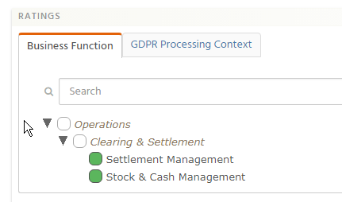
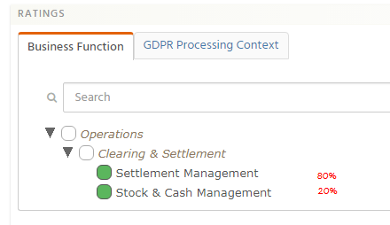

# Measurable Allocation

## Status: DRAFT 

This document is a rough draft.  

## Motivation

Waltz currently holds details of applications and their mappings to various 
taxonomies (measurables).  However we cannot state the comparative weightings 
of these 'app to measurable' mappings, known a measurable ratings.

For instance, given an application which has ratings against 'Settlements' and 
'Stock and cash management', we cannot state that the primary focus of the application 
is Settlement management and Stock and cash management is a secondary function/concern.

Ideally we would like to be able to see allocations against these mappings (mock up below):

## Challenges
- not adding up to 100%
- people removing a mapping (do we attempt to auto correct the other numbers?)
  - What if a removal / add sequence takes place.....
     - e.g. if we swapped Stock & cash management for Clearing management would the 20% get allocated to Settlement Management (bringing it to 100%) then would it get split to the new mapping (resulting in each getting 50%)
- Building a simple UI to allow users to enter this data (see [^1])
  - compounded by data variability, some apps have 40+ ratings.  A lot of UI designs assume low numbers of participant objects in the allocation.
- Hierarchies,
  - do we assume that all nodes are equal regardless of depth... ? 
  - force mapping at a consistent level within a measurable category (i.e. for `Functions we map at level 3`)
  - attempt to get sibling nodes to add up to 100% of the parent (cousins are their own group)
  
  
## Implementation Approach
  
Only applies to concrete elements in the measurable hierarchy.
  
Waltz must support numerous **allocation schemes** for example, 
current spend, relative importance or development effort. 
Each scheme should consist of name, description and related 
measurable category. 

Each measurable mapped to an application is assigned value of
 'Fixed' or 'Floating'.  

- **Fixed pool**: Each measurable which is 'Fixed' is assigned a %. The total sum of 'Fixed' measurables is for an application <= 100%.
  - Upon adding a measurable to the 'Fixed' set: A % must be assigned which does not breach the 100% total for 'Fixed measurables. The floating pool will consequently diminish.
  - Upon removing a measurable from 'Fixed': The % allocation is either added to the 'Floating' pool or distributed equally between the remaining 'Fixed' measurables. 
- **Floating pool**: Remainder of allocation. e.g. 100% - Fixed pool. This is equally distributed between the 'Floating' measurables.
  - Upon adding a measurable to 'Floating': The measurable becomes a member of the 'Floating' pool and is given an equal split of the 'Floating' pool %.
  - Upon removing a measurable from 'Floating': It's auto-allocated % is returned to the floating pool and redistributed equally between the remaining 'Floating' measurables.

_Example:_  Given a Fixed pool of two measurables at 50% and 38% gives a fixed pool of 88% 
and a floating pool of 12%. If there are 3 measurables in the floating pool each would 
have 4%.  If another measurable was added to the floating pool then each would have 3%.  

### Allocation Table Structure

Name | Type | Description
--- | --- | ---
Allocation Scheme Id | Long | FK to Allocation Scheme
Measurable Id | Long | Used to link to Measurable Rating
Entity Id | Long | Used to link to Measurable Rating
Entity Kind | Enum | Used to link to Measurable Rating
Allocation Percentage | 0-100 | Amount allocated to the measurable rating for this allocation scheme
Allocation Type | Enum | Fixed/Float
Last Updated At | Timestamp | -
Last Updated By | User Id | -
Provenance | String | Where this data point came from

### Allocation Scheme Table Structure

Name | Type | Description
--- | --- | ---
Id | Long | Auto-generated PK
Name | String | Name of allocation scheme
Description | String | Description of the allocation scheme
Measurable Category | Long | FK to the Measurable category this schema applies to

## References
[^1]: Discussion on Allocation UIs: https://ux.stackexchange.com/questions/17789/app-interface-for-changing-relational-percentages