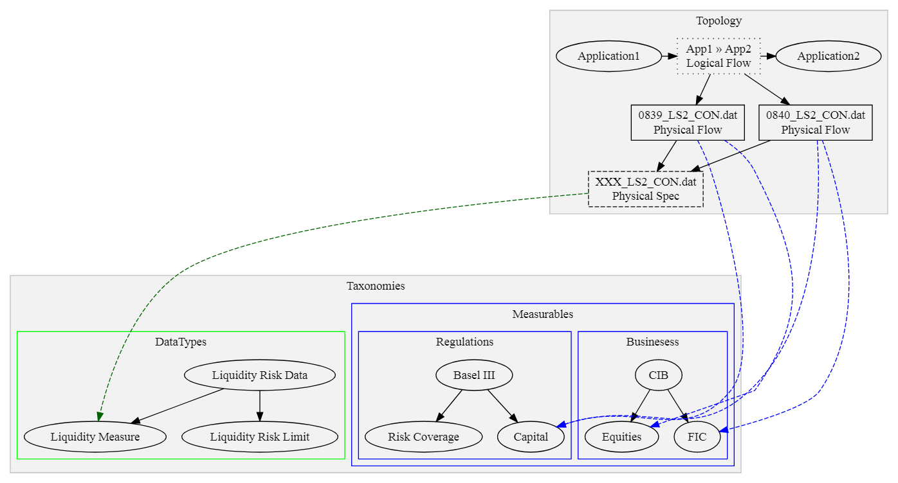

= Physical Flow Ratings in Waltz

== Status: DESIGN (Possibly targeting Q1/2 2020)

== Terminology

This section defines what specific terms mean in the remainder of this document

* *Logical Flow*, abstractly describes all flows between two entities (typically apps)
* *Physical Flow*, a specific instance of a _logical flow_
* *Physical Specification*, details of what is being transferred in a _physical flow_
* *Data Types*, hierarchical structure representing all types of data within the organization
* *Measurable Category*, (aka _Taxonomy_)
* *Measurables*, hierarchical structure representing items in a _measurable category_
* *Rating Scheme / Item*, used to describe the relationship between entities (typically apps) and _measurables_
* *Measurable Rating*, the actual linkage of an entity to a _measurable_ using a _rating scheme item_

== Summary

Currently, only applications can align themselves to _measurables_ via _rating scheme items_. This new
feature will extend the support to include physical flows.

Diagram link:images/physical_flow_ratings.gv[Source]

== Motivation

There is interest in being able to better describe physical flows in terms of existing (and new) _measurable
categories_.  One compelling case is to be able to introduce a _Regulatory_ category which describes a hierarchy
of regulations, and their constituent parts, for example:

* _Basel III_
* _Capital_
** _Pillar 1_
** _Capital_
** _Risk coverage_
** _Containing leverage_
** _Pillar 2_
** _Risk management and supervision_
** _Pillar 3_
** _Market Discipline_
* _Liquidity_
** _Global liquidity standard and supervisory monitoring_

A new _rating scheme_ may then defined with items:

* _Indirectly contributes_
* _Directly contributes_

Combing the _category_ and _scheme_ will allow us to express basic facts such as:

* _Logical Flow_ (`app1` &gt; `app2`)
* _Physical Flow_ `abc.csv` (between`App1` and `App2` - from the _logical flow_)
** has _rating_ `Directly contributes` for (regulation) `Basel III\Capital\Pillar 1\Risk Coverage`
** has _rating_ `Indirectly contributes` for (regulation) `Basel III\Capital\Pillar 3\Market Discipline`
** has _rating_ `Invest` for (business) `CIB`

We can roll-up and aggregate these facts as they are recorded against _measurables_ within a hierarchical taxonomy.

Increasing the information stored against _physical flows_ will allow for techniques such as lineage inference to
be leveraged as incoming and outgoing flows can be matched upon their characteristics expressed via _measurable ratings_
and _data types_.

== Problems

=== Technical

Waltz currently has no support for storing _measurable ratings_ against _physical flows_.

On the backend the existing `measurable_rating` table _does_ support storing non-application ratings however the API
layer will not aggregate them correctly at present.

The user interface will need to be redesigned to show flows instead of applications. 

We need to consider data integrity, _measurables_ associated with flows should also be associated with the parent
entities (e.g. source and target applications) this should be flagged to the user or (perhaps) disallowed.

=== User

We are asking for a lot of additional mapping at a flow level which will place an additional burden on users.
This mapping will be time consuming. It is recommended we investigate options to initially narrow down choices,
only presenting the user with options that have already been used by the app or are strongly linked to other
selected options.

== Example Screens

TBC

== Notes

Implementation tasks will be prefixed with `Flow Ratings` in the issue tracker.

