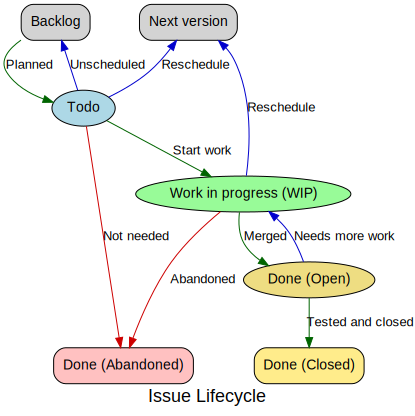

# Issue Management

<!-- toc -->

- [Tags](#tags)
- [Milestones](#milestones)
- [Lifecycle](#lifecycle)

<!-- tocstop -->

Waltz uses Github Issues for tracking all tasks, bugs and change requests relating 
to the core product.  _Every_ pull request _must_ reference an issue in its comment 
and, ideally, the issue number should be reflected in the branch name 
(e.g. `WALTZ-1234-desc`).

## Tags

There are several tags used to categorise the issues, important ones are:

| Tag | Description |
| --- | --- |
| Small Change | Shouldn't take long, low complexity.  Good for beginners |
| Bug | Waltz is not working correctly |
| DDL Change | A database upgrade will be needed after this issue has been merged into the codebase |
| Fixed | Issue has been fixed in the codebase, but has not been necessarily tested in a UAT environment |
| Removal | Issue removes functionality from Waltz.  Keep an eye out for these if you are a waltz user and let us know if this will cause problems for you |

## Milestones

We use a milestones per release (`1.12`, `1.13`, `1.14` etc).  The _under development_ 
release is then split into three further milestones:

| Milestone | Description |
| --- | --- |
| TODO | Planned for this release |
| WIP | Under active development for this release. The number of issues in this state should be _low_ as we discourage working on parallel issues as much as possible |
| DONE | Issue has been completed, this _should_ align with the `Fixed` tag mentioned above.  Once tested the issue should be _closed_.  

## Lifecycle

The following diagram represents the workflow associated with issues.

