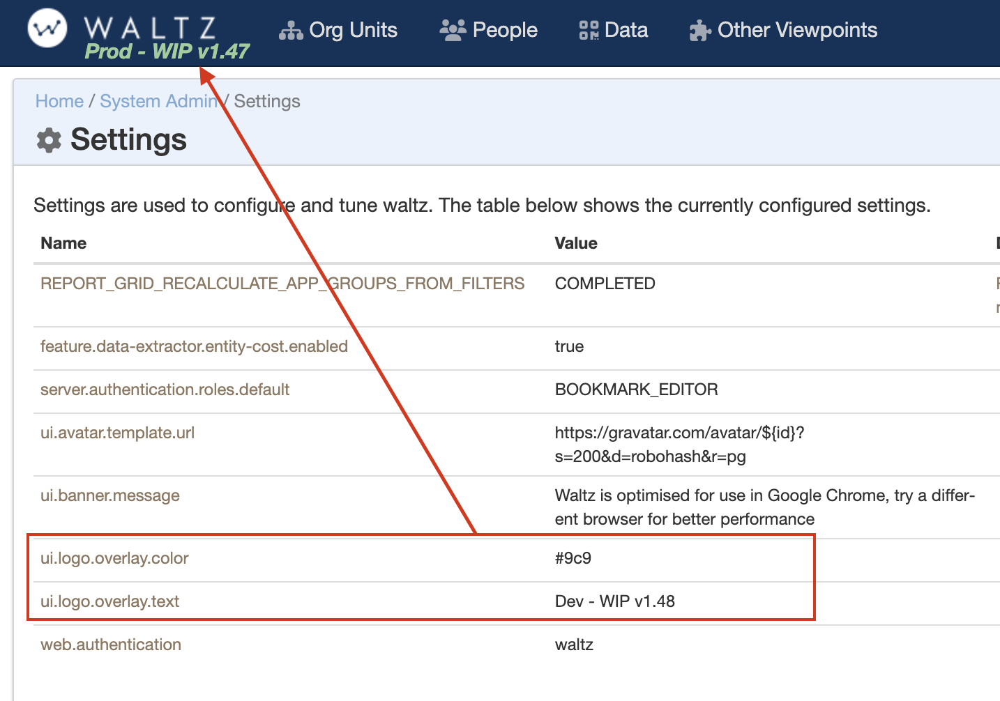

# Upgrading a Waltz Instance

## Overview

This guide will walk you through upgrading an existing version of Waltz.
Upgrading Waltz is _mostly_ automated, however, you may need to update any custom dataloaders to accommodate breaking schema changes.

Waltz uses [Liquibase](https://www.liquibase.org/) to handle the schema and data migration.
Application  code updgrade should be straightforward but depends on your chosen deployment option.

Liquibase works by applying a series of changes to the database.
Therefore, it is possible easily upgrade from any starting schema.
Liquibase looks at the last change it made and then works out all the outstanding changes that need applying.

Liquibase is not limited to just DDL modifications, the changes include steps to automate data migration where needed.
An example of this is when deprecating a table structure and moving the existing data to a new table 
(e.g. [Change: 20170311-236-3](https://github.com/finos/waltz/blob/master/waltz-schema/src/main/resources/liquibase/db.changelog-1.3.xml#L297))

## Upgrade Steps


If you want to understand what the upgrade _will do_, please skip ahead to the next few sections of this page which go through finding your current version and using that information to see pending changes.

Once you are ready to perform the update, we recommend the following steps:

- Stop Waltz
- Backup your database.  See the database [Dump and Restore](database/dump_and_restore.md) docs for more. 
- If you are deploying on tomcat take a backup of the waltz `war` file.  
  - If you know your version number you can also re-download this from the [Releases Page](https://github.com/finos/waltz/releases) if required
- Upgrade the database using Liquibase, either:
  - Run Liquibase directly against the database (see [Liquibase / Executing the Changes](../../waltz-schema/src/main/resources/liquibase/README.md#executing-the-changes-using-liquibase)) 
  - If you cannot use Liquibase to apply changes directly to your database, then use liquibase to generate DDL which can be subsequently applied to the database (see [Liquibase / Generating SQL](../../waltz-schema/src/main/resources/liquibase/README.md#generating-sql-for-the-changes))
  - If you are a developer, you may find it easier to apply changes using Maven. Check out this [screencast](https://waltz.finos.org/blog/waltz/dev/screencast/2020/06/25/dev-schema-modifications.html) for more info.
- Verify the schema migration, you should see entries in the `dbchangelog` table for the latest version/filename 
- Deploy the new web application using your standard deployment approach
- Restart Waltz


## Finding the current version

There are currently several places you can look for version information in Waltz.

### Finding current version from build artifacts

Inside each Waltz jar (or war) will be a folder structure similar to: `META-INF/maven/org.finos/waltz-web` containing a file titled `pom.properties`. 

The file contains version information, for example:

```
artifactId=waltz-web
groupId=org.finos
version=1.47.2
```

**Note**: this file was only populated starting from [Waltz 1.43](https://github.com/finos/waltz/releases/tag/1.43).

### Finding current version from the Waltz database

Waltz releases are frequently accompanied by database releases. We use Liquibase to apply schema changes and migrate data.
Liquibase writes all of it's changes to a change log table (`dbchangelog`).
We can query this to find the list of schema files applied to the database (latest first) using the following query 

```sql
with raw as (
        select filename,
               row_number() over (partition by filename order by dateexecuted desc) rn
        from databasechangelog
        order by dateexecuted desc)
select filename from raw where rn = 1;
```

Which gives output like:
```
+-----------------------+
|filename               |
+-----------------------+
|db.changelog-1.48.xml  |
|db.changelog-1.46.xml  |
|db.changelog-1.47.xml  |
|db.changelog-1.45.xml  |
|db.changelog-1.44.xml  |
|db.changelog-1.43.xml  |
|db.changelog-1.42.xml  |
|db.changelog-1.41.xml  |
|db.changelog-1.40.xml  |
|db.changelog-1.39.1.xml|
|db.changelog-1.39.xml  |
|db.changelog-1.38.xml  |
|... snip ...           |
|db.changelog-1.5.xml   |
|db.changelog-1.4.xml   |
|db.changelog-1.3.xml   |
|db.changelog-1.2.xml   |
|db.changelog-1.0.xml   |
+-----------------------+
```


### Upcoming - UI View

Waltz 1.48 will provide mechanism to verify the release number via the Waltz user interface.
Issue: [#6497](https://github.com/finos/waltz/issues/6497)


## Major / Breaking Changes

Once the starting point is known please use the Github release and issues pages to see related major and breaking changes from your version to the desired target version.

**Major changes** will be mentioned in the release notes and their associated issues will be flagged with the `Noteworthy` label.

Changes that are likely to **break external loaders** will be flagged with the `Breaking Change` label.
**Note**: the `Breaking Changes` issue will not impact core Waltz as data will be automatically migrated, however we cannot update any existing external loaders.

Some changes are labelled with `DDL Change`.  These are less likely to break loaders but you should scan through the list to see if any are likely to impact you.

_Please raise_ issues if you are impacted by any of the changes we will investigate workarounds and ensure the issues are updated to reflect any difficulties encountered.


----


## Tips

Once the upgrade is complete use the admin screens to display the version information on the nav bar:



This will need to be updated manually whenever a release is performed.
As can be seen in the example above it can also be used to show other data, such as environment.