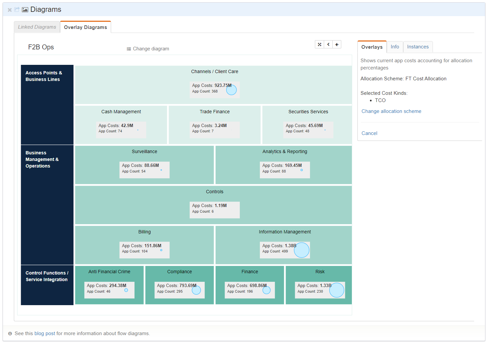
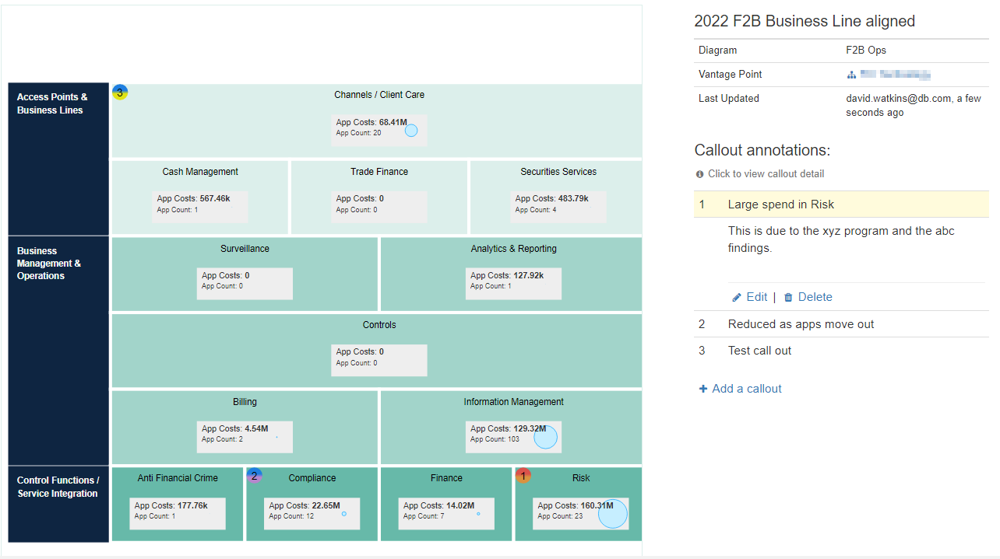
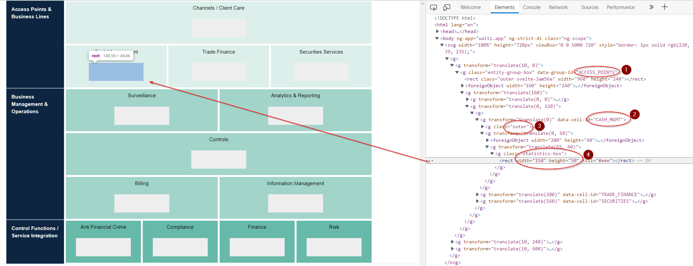
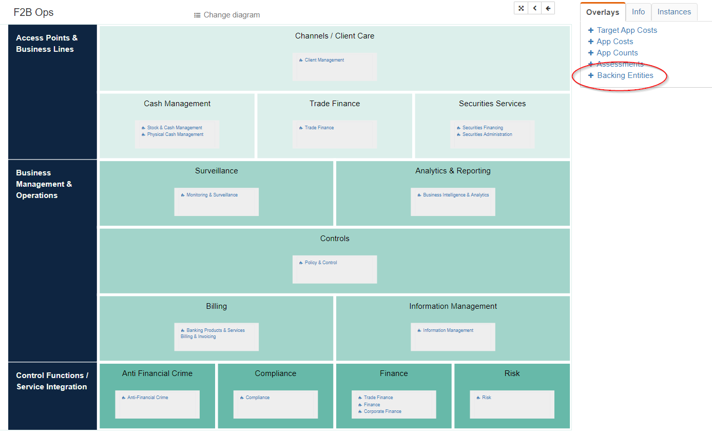
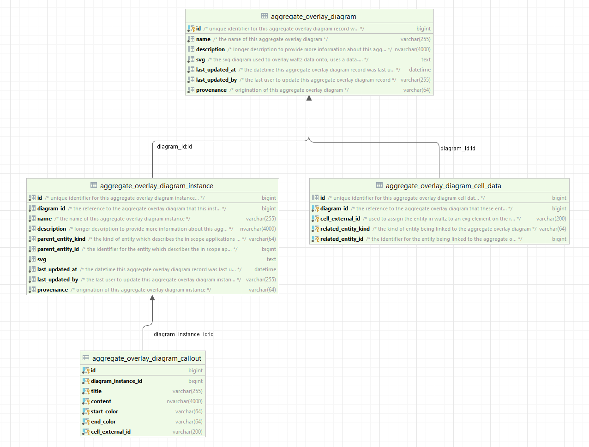

= Aggregate Overlay Diagrams

== Overview

Aggregate overlay diagrams can be used to overlay dynamic data on top of static _template_ images.

Each underlying diagram defines a set of regions where data can be overlaid.
There regions, known as _cells_, can have different information overlaid in them by cell renderers.

<<<

=== Dynamic usage

Overlay diagrams are available on most of the grouping entity pages in Waltz (such as _Org Unit_, _App Group_, _Person_ etc).
The grouping entity provides the raw set of applications to be rendered onto the diagram, we call this the _vantage point_.

Each cell can filter this raw set of applications by use of other grouping elements in Waltz.  For example a cell can be _mapped_ to one or more elements in a functional taxonomy.

When a diagram is selected by the user the cells will be blank until the user picks a cell renderer.
Each cell renderer is given information derived from the set of applications that are intersection between the apps from the vantage point and the applications related to the elements mapped by the cell.

.Dynamic example

The example above shows a dynamically rendered overlay which is using an _Application Cost_ renderer.

==== Supported Overlays

Waltz 1.41 supports several overlays, including:

- App Costs: _select cost kind and allocation scheme for a shredded view of costs_
- App Counts: _including future projected counts based on app retirement dates_
- Assessments: _overlays a bar chart of assessment values for a given assessment definition_
- Backing Entities: _shows which backing entities are mapped to each cell_

.Overlay Types

<<<
=== Instance Snapshots

Aggregate Overlay Diagrams also support _instance snapshots_.
The dynamic view is calculated on the fly by the server and is liable to change over time.
The instance view takes a snapshot of a dynamic rendering and persists it, along side the vantage point that was used to populate the diagram.

Once an instance is created it can be annotated with  _Callouts_ which allow users to provide explanatory text alongside the snapshot.

.Callout Example

The example above shows an instance with the costs overlay and 3 callouts.
Note that each callout can
have a upper and lower color.

<<<
== Setup

To create new diagrams you must provide a base image with placeholders to identify where the overlays and callouts will be placed.

=== Template Images

In the above example we can see that a custom property is defined to identify:

- (1) the group:  _currently unused at runtime_
- (2) The cell identifier, `data_cell`: _an identifier for the overall cell_
- (3) A region marked with the class `outer`:  _this defines the bounds of the cell, callouts are placed in the top left_
- (4) A region marked with class `statistics-box`: _this should be a box with the ratio 3:1.  Overlays are placed here_

<<<
== Mapping Cells

.Cell Mapping

Mapping cells to backing entities is not currently supported via the gui.
Cells must be mapped directly in the database using the `aggregate_overlay_diagram_cell_data` table.
However, mappings are visible using the _Backing Entities_ overlay.

<<<
== Technical

=== Table Structure

