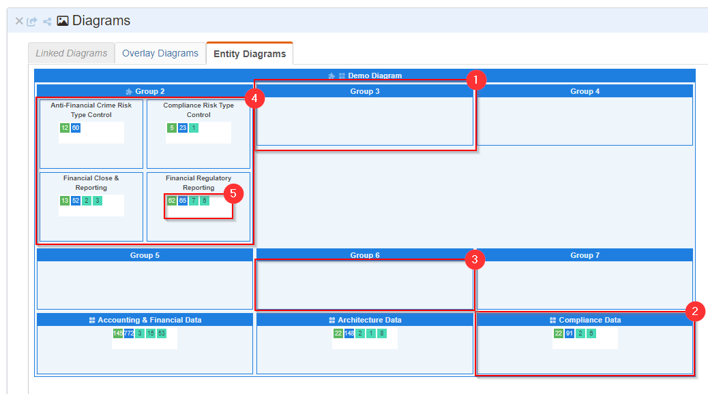

# Overlay Diagrams

## Overview

Overlay diagrams can be used in a number of ways. Depending on the `diagram_kind` specified, the `layout_data` will be rendered differently. 
This document will describe overlay diagrams of the kind `WALTZ_ENTITY_OVERLAY` which can be constructed using the diagram builder  by system admin and rendered on group pages in the diagram section. 

Entity Overlay Diagrams are constructed of 'group cells' which may or may not be backed by an entity e.g. a measurable, person or data type. 
The cell contents can show aggregated waltz data relating to the backing entity of the cell by selecting one of the overlays.


## Model

We make use of `aggregate_overlay_diagrams` for storing entity overlay diagram data.

- `aggregate_overlay_diagram` - captured the diagram info and layout data
- `aggregate_overlay_diagram_Cell_data` - stores the backing entities for the diagram cells. The `cell_external_id` maps to the `id` field in the `layout data` on the diagram.

### Visual Concepts



| Name          | Description                                                                                                                                                                                                                                                                                                    |
|---------------|----------------------------------------------------------------------------------------------------------------------------------------------------------------------------------------------------------------------------------------------------------------------------------------------------------------|
| Group Cell    | A unit drawn on the diagram as a box (1). Constructed of two parts: a title (can be hidden), and a content box. Optionally can be backed by data (2), the backing entities can be a 'PERSON', 'MEASURABLE' or 'DATA_TYPE'.                                                                                     |
| Content Box   | Area used to display the contents of the group cell (3). If this group contains children, these child groups will be displayed in the content box (4), otherwise the cell contents will be shown. Child groups can be a mixture of groups backed by different entity kinds and groups without a backing entity |
| Cell Contents | Data relating to the cell is shown in the cell contents. If there is no data associated to the cell then the group will appear empty (1). Otherwise the selected overlay will be shown (5), by defualt the backing entities are displayed.                                                                     |
| Overlay       | Visual produced by aggregating information related to the backing entity of the cell at the given vantage point (5). Overlays exist for all cells backed with data (although all may not be visible as child groups are shown).                                                                           |

### Layout Data

A diagram is constructed of nested groups, stored as JSON in the `layout_data` field, with associated data linked to each group. Each group has the following attributes:

| Name            | Description                                                                                                                                                                                                                     |
|-----------------|---------------------------------------------------------------------------------------------------------------------------------------------------------------------------------------------------------------------------------|
| id              | A GUID to uniquely identify the group                                                                                                                                                                                           |
| parent_id       | A reference to the parent group                                                                                                                                                                                                 |
| title           | Text to be displayed in the title bar. When adding groups with data the title is defaulted to the name of the entity added                                                                                                      |
| properties      | Information to style the group cell. e.g. cell width, cell height, show title, show border, title color, background color etc. Defaults if not explicitly set.                                                                  |
| data (optional) | An object containing the entity reference to the backing entity for this cell. Formally captured in the `aggregate_overlay_diagram_cell_data` but retained in the layout information in case of reconstruction from this object |                                                                      | 

Example: 
```
[
    {
        "title":"Demo Diagram",
        "id":"08e5ffb6-ee04-4809-8357-49191b0ede14",
        "parentId":null,
        "props": {
            "minHeight":5,
            "minWidth":10,
            "flexDirection":"row",
            "showTitle":true,
            "showBorder":true,
            "bucketSize":3,
            "proportion":1,
            "titleColor":"#1F7FE0",
            "contentColor":"#eef5fb",
            "contentFontSize":0.7,
            "titleFontSize":0.8},
            "position":1
        }
    }
]
```


## Features

### Builder

Available via the 'System Admin' page. Users with admin privileges can create / edit diagrams. 

### Section

A list of active diagrams can be selected from in the diagrams section.