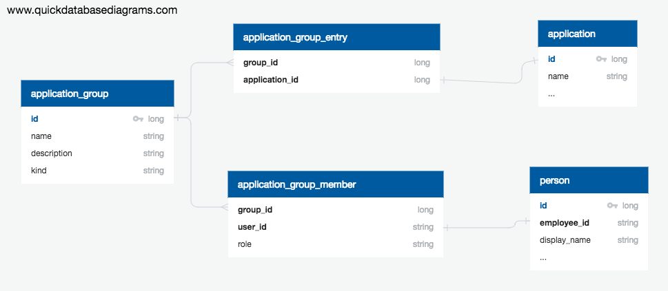

# Application Groups

## Overview

Application groups allow users to create an ad-hoc collection of
applications which can they be visualised using the standard
set of views in Waltz.

Users may create new groups or subscribe to existing groups. Groups may 
be __public__ or __private__.  If a group is public any user may 
subscribe to it.  For private groups a user must be explicitly 
invited.  Group owners may modify the applications which comprise the 
group at any time.
 

## Model

[Source](https://app.quickdatabasediagrams.com/#/schema/zc5QN1v4SEeBez8OnMJyRQ)

Application groups are modeled via a base table `application_group` which 
describes the basic characteristics of the group including it's kind which is 
either:
- `PUBLIC` 
- `PRIVATE`.  
 
Zero or more applications are associated with the group via 
the `application_group_entry` tables.  

Users connected to the group are
associated via the `application_group_member` table, their role in the group 
is one of:
- `VIEWER`
- `OWNER`

It is anticipated that additional roles will be added to groups in subsequent 
releases.

---
[Back to ToC](../README.md)
