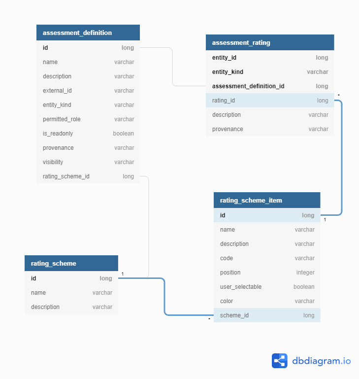

= Assessments

== Overview

Assessments provide a mechanism to introduce new characteristics against
entities in Waltz.

Entities that currently supported assessments include:

- Applications
- Change Initiatives
- Change Sets / Units
- Physical Specifications
- Software Licences
- Software Packages

== Setting up new Assessment Definitions

