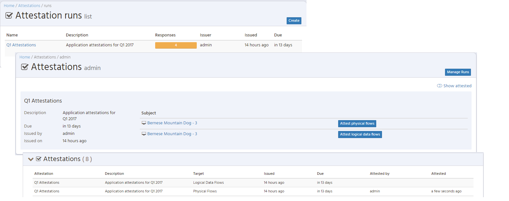
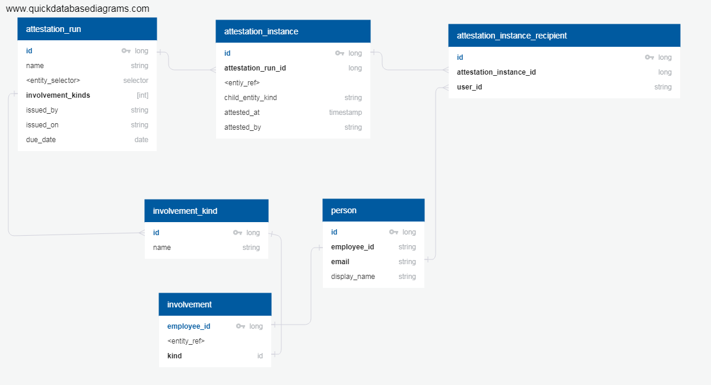

# Attestations

## Overview

Attestations allow for users to confirm the validity of
various aspects of entities they are involved with.  Currently
attestations are available for applications where users can
confirm the validity of logical and physical data flows.
Attestations are issued to users matching a given set of roles describing
their involvement with an entity. The set of target entities
for the attestation is derived from a Waltz selection mechanism
(e.g. apps under a specific organisational unit, apps performing
a specific function etc.).

## Model

---
[Back to ToC](../README.md)