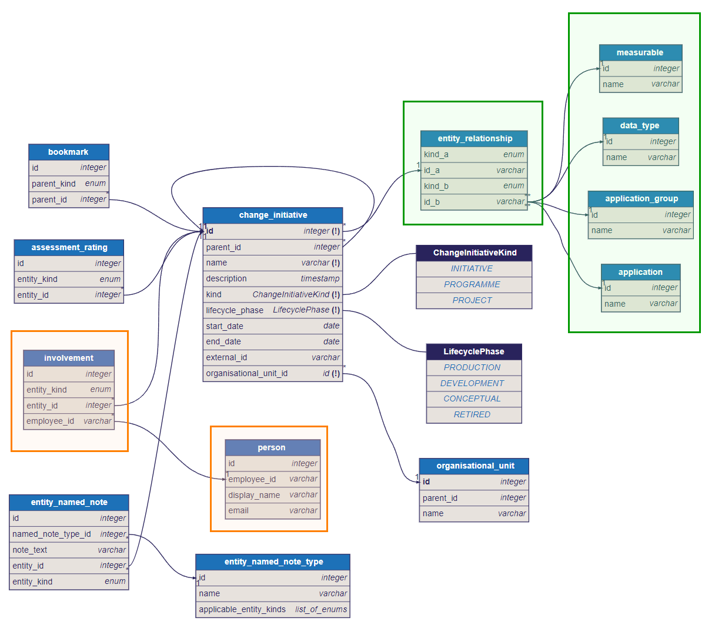
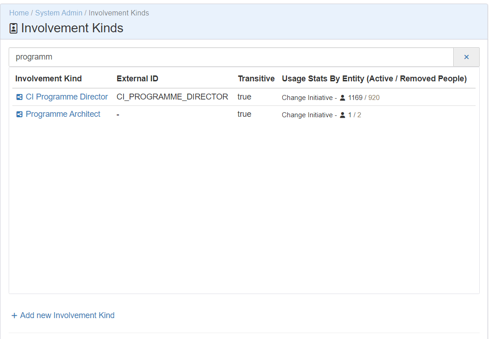
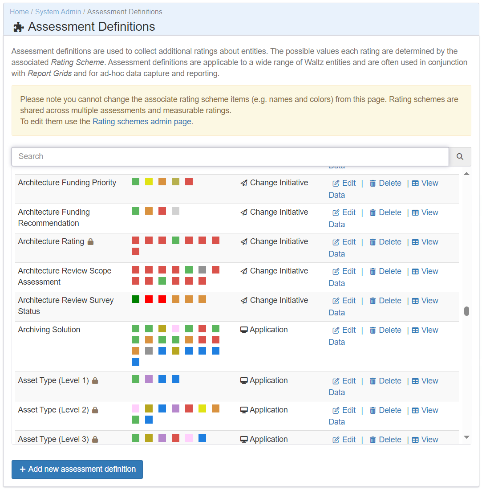

# Change Initiatives

## Hierarchies

Change Initiatives are hierarchical with a standard parent child relationship (`id` and `parent_id`).  However, the 
user interface currently only expects a 3 level hierarchy corresponding to the following relationships:

- _Initiatives_ are top level entities 
- Each initiative own one or more _Programmes_ 
- Programmes own one or more _Projects_

These relationships are explicitly modeled in the `change_initiative:kind` column.

## Linking to other entities

This diagram shows the main relationships between change intiatives and other Waltz entities.

### Applications, Groups, Measurables and Data Types

There are no dedicated join tables for linking Change Initiatives to other Applications, App Groups, Measurable (taxonomy items), and Data Types in Waltz.
Instead, the generic `entity_relationship table` is used which links two elements (`a` and `b`).  This is shown in green on the schema diagram above.

By convention, we use the relationship's entity `a` (`kind_a` / `id_a`) as the reference to the change initiative and entity `b` as the linked entity.  For example:

| kind_a            | id_a | kind_b      | id_b | kind         | 
|-------------------|------|-------------|------|--------------|
| CHANGE_INITIATIVE | 23   | APPLICATION | 72   | 'RELATES_TO' |
| CHANGE_INITIATIVE | 23   | APPLICATION | 289  | 'RELATES_TO' |
| CHANGE_INITIATIVE | 23   | MEASURABLE  | 362  | 'RELATES_TO' |
| CHANGE_INITIATIVE | 23   | DATA_TYPE   | 48   | 'RELATES_TO' |

### People

People can be related to a CI using the standard `involvement` tables
which link a `person` via a `involvementKind` (role) to an entity.  This is shown in orange on the schema diagram above.  The involvement kinds (for example _Programme Architect_) can be set up using the admin UI (via: _System Admin > Reference Data > Involvement Kinds_):

### Bookmarks, Assessments, and Named Notes

#### Bookmarks

_Bookmarks_ are a simple mechanism to capture some basic information about entities in Waltz.  Change Initiative are fully supported by bookmarks and are directly linked to the `bookmark` table via the `parent_kind`/`parent_id` columns. 

#### Assessments 

_Assessments_ are widely used in Waltz to decorate entities with  a set of enumerated values.  For Change Initiatives these tend to reflect data points around the initiative status, funding, priority etc.  As with the involvement kinds for people, assessment definitions can be maintained via the admin UI:

#### Named Notes

_Named Notes_ are less well-used across Waltz.  The purpose behind Named Notes to is to provide some basic organization around unstructured markdown documentation.  Examples include some reference data around the initiatives structures and reporting lines which could not be cleanly modelled.  Instead the data was pre-rendered into markdown tables and linked to the initiatives via the `entity_named_note` tables.

