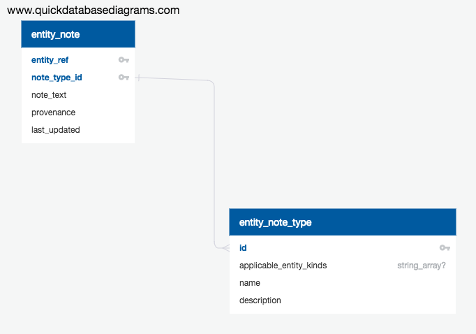

# Entity Notes

## Overview

Allow for structured textual notes to be attached to entities.  Rendered using markdown.

## Model

[Source](https://app.quickdatabasediagrams.com/#/schema/nUjgNogoVEmZ1a8uFr0mZg)

---
[Back to ToC](../README.md)