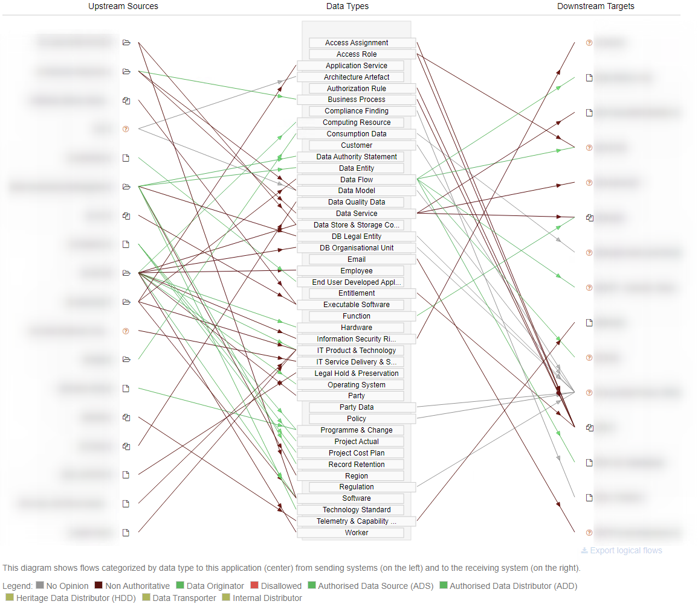
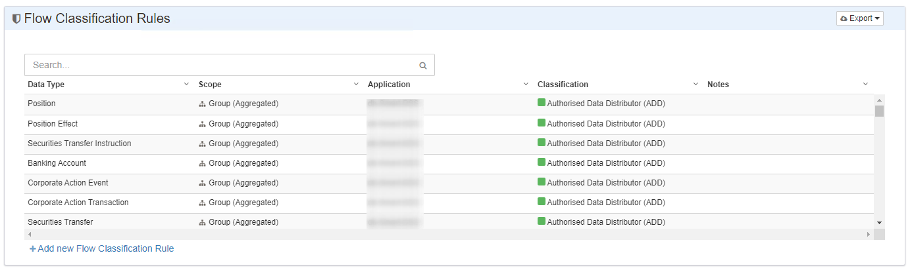
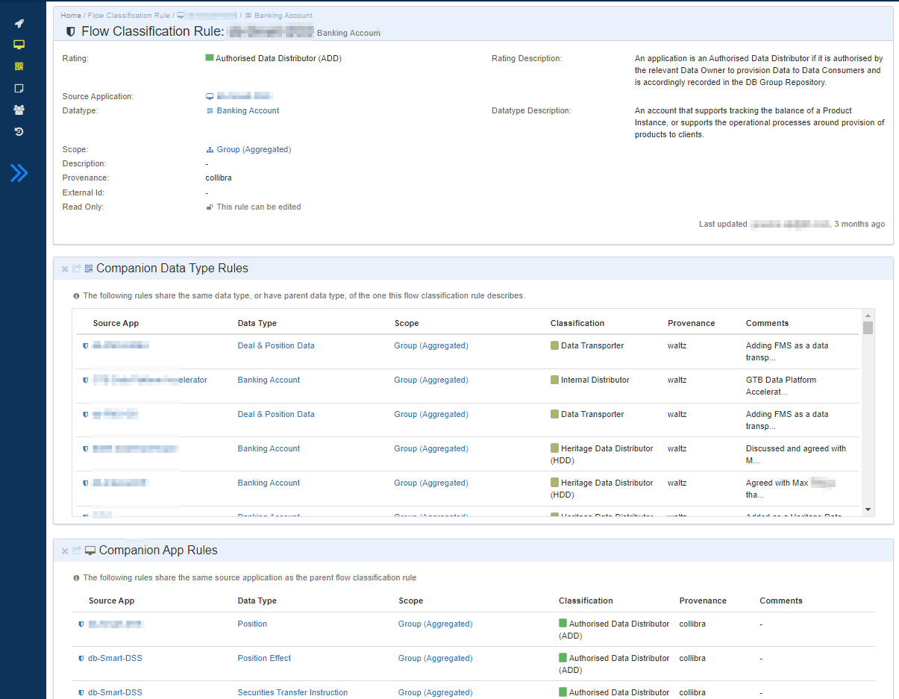
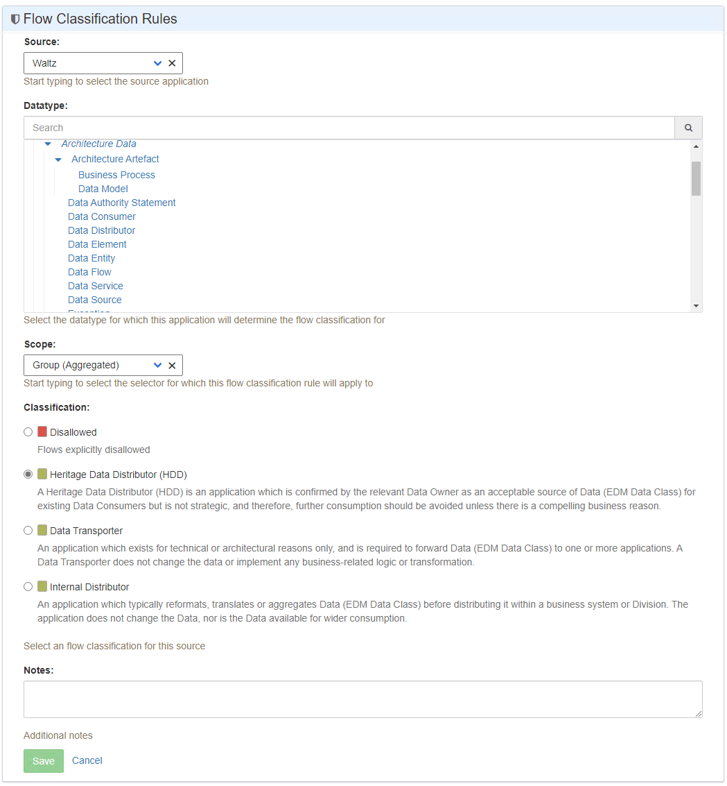

# Flow Classification Rules

## Overview
Organisations often have rules for 'right-sourcing' data.
These rules dictate which applications are authorised to distribute particular data types to other applications.
Different parts of the organisation may have differing source applications for data types.

Waltz can use these rule definitions to calculate classification ratings on logical flows based upon their source, target and data types.
The set of classification can be configured by administrators and each classification has an assigned color.

.Source and Target diagram

The diagram above shows an example of an application with multiple inbound and outbound flows of differing types.
The coloring of the arcs indicates the classification of each flow/datatype.
The legend is towards the bottom.

## Rules
Rules require 4 pieces of data, they are:

* a source application
* a node in the data type hierarchy
* a scoping definition
* a resultant classification outcome

### Source Application
The _source application_ is simply a reference to an existing application in Waltz.

### Data Type Node
The _data type node_ can be either a specific leaf node or a element higher up the data type hierarchy.
If the node has child elements the rule will apply to all child data types.

### Scoping Definition
The _scoping definition_ is a reference to an entity in Waltz which defines one or more applications that this rule applies to.
Supported scopes are currently:

* _organisational unit_: typically used to either indicate the rule applies to all applications (i.e. the org unit is set to the root of the org unit tree), or is used to limit the scope to a particular organisational subset.
* _specific application_: typically used for legacy/heritage classifications
* _application group_: used to define an ad-hoc set of in-scope applications

### Classification Outcomes
The resultant _classification_ is the value that will be applied to all matching flows.
There are two system-defined classifications:

* `NO_OPINION` - no rules matched the flow, therefore no classification rating can be given
* `DISCOURAGED` - there are rule/s which have a scope which includes the consuming application and also includes the declared data type.
However, this flow does not match any of the defined rules.

Waltz installations are free to re-label these classifications and redefine their colors as required.

Installations may also introduce additional classification outcomes.
Additional outcomes need items such as _name_, _description_ and _color_.

Classifications can also declare whether they are _user selectable_.
Non _user selectable_ classifications are used to prevent manual creation of rules referencing that classification.
An example of this is when particular classification outcomes and their associated rules are mastered in another system and we wish to import those rules, but prevent users from creating _similar_ rules directly in Waltz.

[NOTE]
Classification outcomes can **only be created directly in the database** by administrators, no UI screens exist for managing them.
They are held in the table: `flow_classification`.

## Rules

### Viewing

On the _Data Types_ page there is a section called _Flow Classification Rules_.
This section lists all defined rules and allows them to be viewed, exported and, if the user has sufficient privilege, register new rules.

.Rule list

Clicking on a rule takes you to a page which shows the rule in more detail.
For example:

.Rule View

In the above screenshot we can see the rule in the top section.
It clearly shows the classification rating (_ADD_), the source application, the data type (_Banking Account_) and the scope (_Group_ - the whole organisation).

Two other sections are shown in this screenshot.
The first, **_Companion Data Type Rules_**, shows other flow classification rules which share the same data type.
This quickly allows you to see which other apps have been registered against a rule.
In this example we can see many rules with the same data type, but we can also see rules which have been declared against parent data types (in this case: _Deal & Position Data_)

The second, **_Companion App Rules_**, show other flow classification rules which have been declared against the same application.
In this case we can see the

Waltz allows rules to be created via the user interface.
If the user has the appropriate role assigned they will see that this application is also an official distributor of data such as: _Positions_ and _Securities Transfers_.

### Registration

Rule registration can be accessed from the rule list section if the user has the appropriate permissions.
This permission, `AUTHORITATIVE_SOURCE_EDITOR`, can be granted by Waltz user administrators via the UI.
With this permission users can create and edit rules with the following restrictions:

* rules marked as read-only in the database cannot be changed or deleted
* rules with non _user selectable_ classifications cannot be created
** Typically these classifications coincide with the _read-only_ flag to ensure they cannot be edited either

[NOTE]
If a user has permission to edit rules, they can edit all the rules (except where the above restrictions apply)

.Rule registration

The screenshot above shows the rule registration screen.
The four key pieces of data are required and an optional note can be added to the rule.

[NOTE]
The classifications shown are bespoke for the installation the screenshot was taken from.

Once registered the rule takes immediate effect.
Waltz will recalculate the flow classifications and update flows with the results.
This recalculation should also be ran after any external jobs insert flow data or new rules.
The recalculation can be triggered manually via the admin screens (_Recalculate Derived Fields_ >> _Recalculate Fow Rating_ ) or programmatically.

## Rule Precedence

Rules can conflict with each other, to ensure predictable flow ratings there is a clear order of precedence when Waltz executes the rules.

The highest priority are rules where the scope is a single application.
In case of duplicates (i.e. a rule for a parent data type and an _override_ for a child data type) the more specific data types take precedence.

Next are the rules which use an app group as the scope.
As before, more specific data types take precedence.

Finally, the rules which are declared with Org Unit scopes are evaluated.
These are ordered by giving precedence to the most specific org units (lower in tree) and then, as before, ordering by data type specificity.

