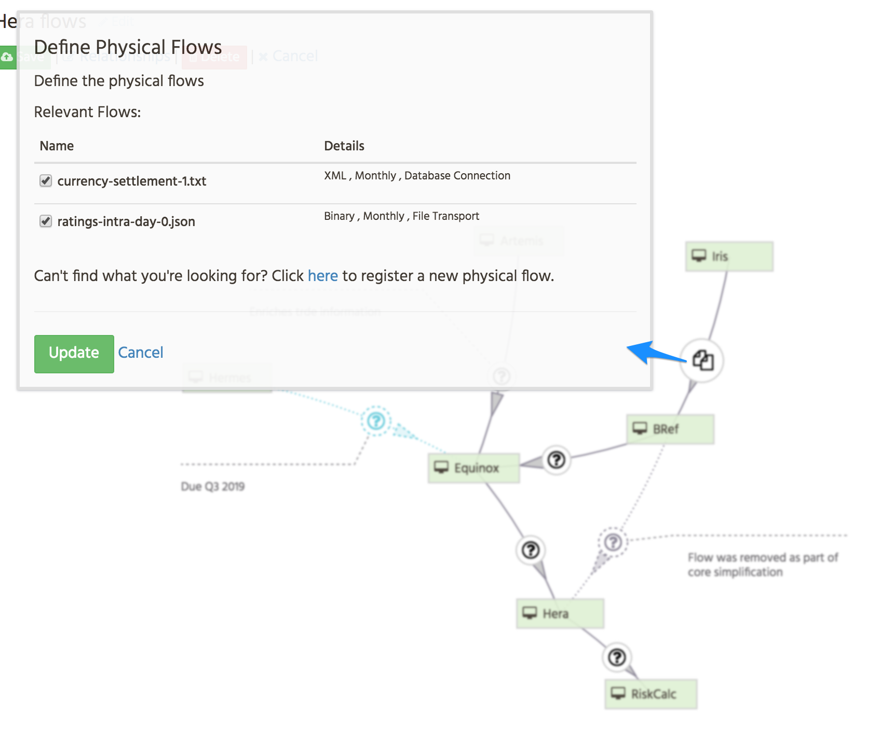
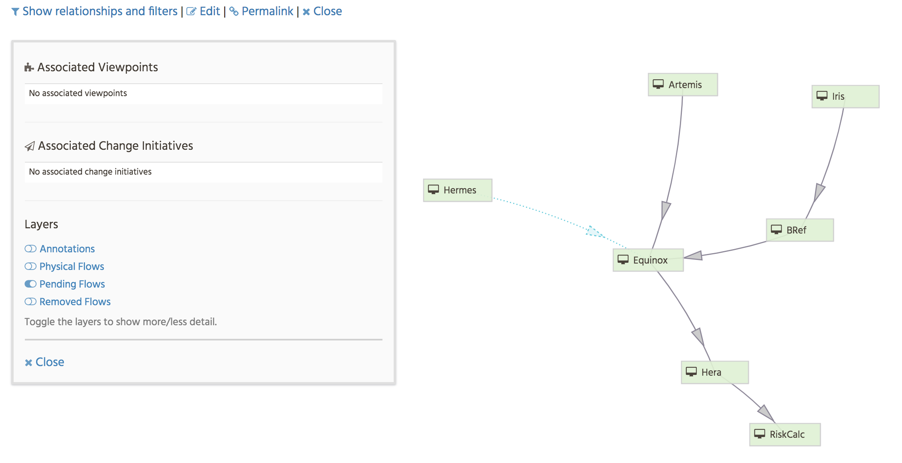
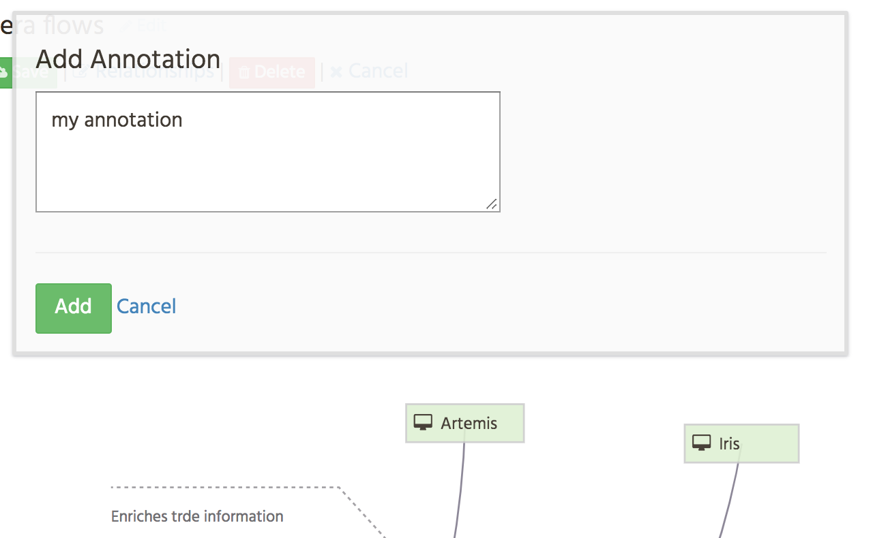

# Flow Diagrams

## Overview

Flow Diagrams allow users to visually illustrate how data flows
between applications (and actors).  Flow diagrams are constructed using the 
flow information contained within the logical and physical flow stores.  
This allows the elements of the diagram to be verified and cross referenced.

The typical use for flow diagrams is to quickly illustrate a particular 
scenario. Unlike the logical flow section, which shows all (single hop)
upstream/downstream flows, a flow diagrams have been designed to help
users to illustrate multi-hop scenarios.  

Flow diagrams are intentionally constrained by the underlying logical/physical 
flow model, it is not possible to draw flows which do not exist (though future
state flows are permissible).  

### Features

| Feature | Description |
| --- | --- | 
| Model aware | Diagrams are constrained and linked to model elements |
| Removed / Pending flows are highlighted |  |
| Link to physical flows | Diagrams can be enriched by linking to the underlying physical flow definitions  |
| Layered | Flows data, annotations etc. are stored in layers which may be toggled  |
| Annotations | Flows and entities can have annotations associated to them  |
| Cross referenced | Due to model linkage, flow diagrams are cross referenced to all entities involved |
| Self contained group | By clicking on the _permalink_ hyperlink users can see a page devoted to that diagram.  The contents of the diagram are used to populate the sections |

## Model

[Source](https://app.quickdatabasediagrams.com/#/schema/nUjgNogoVEmZ1a8uFr0mZg)

Flow diagrams are stored across three tables.  The primary table is 
`FLOW_DIAGRAM` and stores the basic details of the diagram alongside the
`layout_data` which is a stored as JSON object within a CLOB column.  The JSON
object details the current diagrams transformation (_translation_ and _scale_) and 
map giving the positions of the diagram elements.  This position map is keyed by
the entity ref of the element  (in the form `<kind>/<id>`).  

`FLOW_DIAGRAM_ENTITY` acts like a bill of materials for the diagram.  It is used
to cross link a diagram to each of the elements depicted in it.  The `is_notable`
field is not currently used but will allow us to filter these crosslinks to only
references which have been flagged as notable.

`FLOW_DIAGRAM_ANNOTATION` contains all notes attached to the diagram.  Each note is 
associated to a specific entity.  It's location in the position map (in the JSON obj) 
is expressed in terms of deltas (`dx` & `dy`) therefore the annotations position is 
relative to the annotations subject (the entity).

---
[Back to ToC](../README.md) 