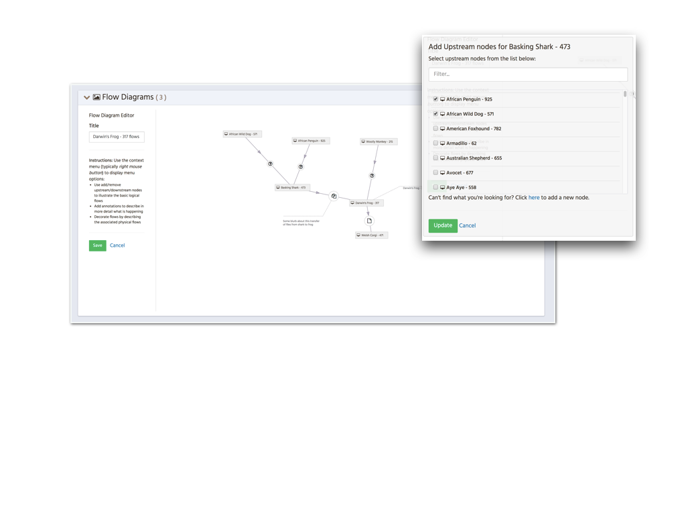
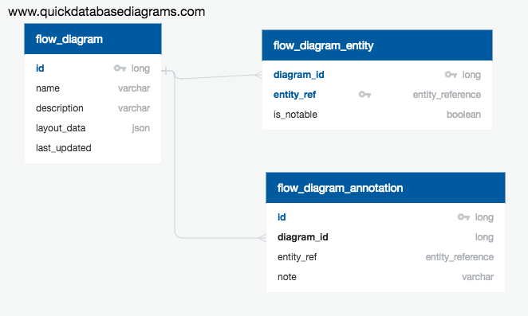

# Flow Diagrams

## Overview

Flow Diagrams allow users to visually illustrate how data flows
between applications (and actors).  Unlike the existing logical 
flow view these diagrams can show the full upstream and downstream 
flows.    

## Model

[Source](https://app.quickdatabasediagrams.com/#/schema/nUjgNogoVEmZ1a8uFr0mZg)

Flow diagrams are stored across three tables.  The primary table is 
`FLOW_DIAGRAM` and stores the basic details of the diagram alongside the
`layout_data` which is a stored as JSON object within a CLOB column.  The JSON
object details the current diagrams transformation (_translation_ and _scale_) and 
map giving the positions of the diagram elements.  This position map is keyed by
the entity ref of the element  (in the form `<kind>/<id>`).  

`FLOW_DIAGRAM_ENTITY` acts like a bill of materials for the diagram.  It is used
to cross link a diagram to each of the elements depicted in it.  The `is_notable`
field is not currently used but will allow us to filter these crosslinks to only
references which have been flagged as notable.

`FLOW_DIAGRAM_ANNOTATION` contains all notes attached to the diagram.  Each note is 
associated to a specific entity.  It's location in the position map (in the JSON obj) 
is expressed in terms of deltas (`dx` & `dy`) therefore the annotations position is 
relative to the annotations subject (the entity). 