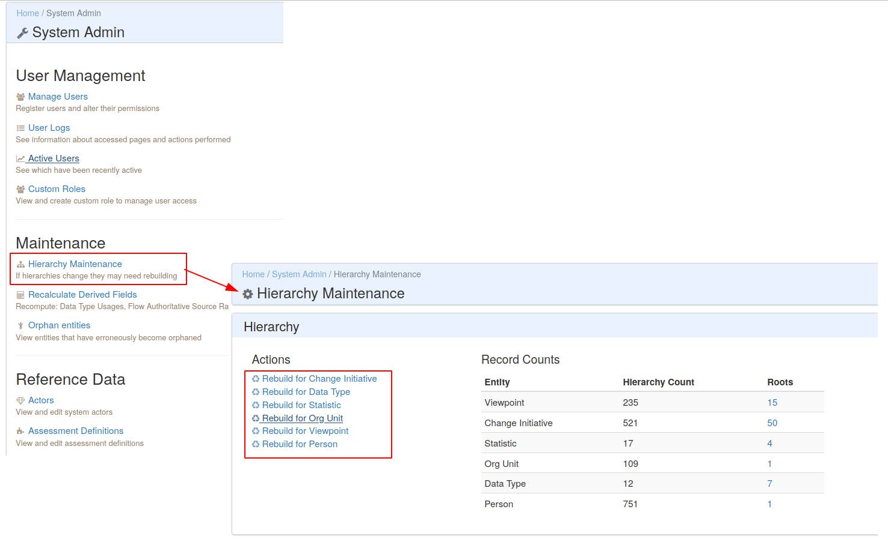
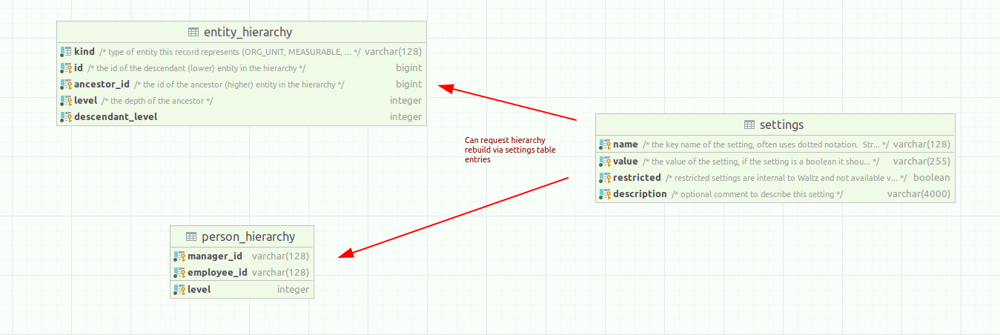

# Hierarchies

## Overview

Waltz supports numerous hierarchical entities.
These include:

- Organisational Units
- People
- Measurables
- Change Initiatives
- Data Types
- etc

To quickly traverse these hierarchies we use two key tables:

- `entity_hierarchy` - used for most hierarchical entities other than `person` entities
- `person_hierarchy` - only used for the `person` hierarchy

These tables follow the basic _bridge_ (or _closure) pattern for representing hierarchies.  

----
## Rebuilding hierarchies


Waltz provides two mechanisms for rebuilding hierarchies: 

### Manual Rebuild

The first is via the admin screens:




### Via Job Service

There is a periodic service in Waltz which can perform various housekeeping tasks.
There are several tasks which relate the rebuilding the hierarchy tables.
Each task can be requested by updating an entry in the `settings` table.  

For example to request a rebuild of the _Org Unit_ hierarchy then ensure the `settings` table has an entry like:

| name                         | value      |
|------------------------------|------------|
| `HIERARCHY_REBUILD_ORG_UNIT` | `RUNNABLE` |

If Waltz is running, you should see the value change to `RUNNING` as the job is executed and then `COMPLETED` (or `ERRORED`).  These constants are defined in the class `org.finos.waltz.model.scheduled_job.JobLifecycleStatus`)

The complete list of supported job 'keys' is in the class `org.finos.waltz.model.scheduled_job.JobKey`.
The main ones are:

- `HIERARCHY_REBUILD_CHANGE_INITIATIVE`
- `HIERARCHY_REBUILD_DATA_TYPE`
- `HIERARCHY_REBUILD_ENTITY_STATISTICS`
- `HIERARCHY_REBUILD_MEASURABLE`
- `HIERARCHY_REBUILD_ORG_UNIT`
- `HIERARCHY_REBUILD_PERSON`

----

## Database Schema




### Example Queries

#### Find descendents:
```

-- example query to return all descendents of a particular org unit (50)
select ou.*
from entity_hierarchy eh
inner join organisational_unit ou on eh.id = ou.id -- joining on id to go 'down' the tree
where eh.kind = 'ORG_UNIT'  -- ensure you restrict the entity_hierarchy traversal to ORG_UNITs
and eh.ancestor_id = 50;  -- starting point
```

#### Find Ancestors
```
-- example query to return all ancestors of a particular org unit (50)
select ou.*
from entity_hierarchy eh
inner join organisational_unit ou on eh.ancestor_id = ou.id -- joining on ancestor to go 'up' the tree
where eh.kind = 'ORG_UNIT'  -- ensure you restrict the entity_hierarchy traversal to ORG_UNITs
and eh.id = 50;  -- starting point
```

## Usage in the code base

The hierarchies are used extensively throughout the code base.  In particular, they are used heavily in the _Selector Factories_ which take a starting entity and a direction, then return an sql fragment which gives the appropriate identifiers.  See `org.finos.waltz.data.application.ApplicationIdSelectorFactory` for an example.
