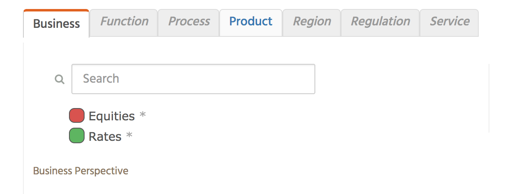
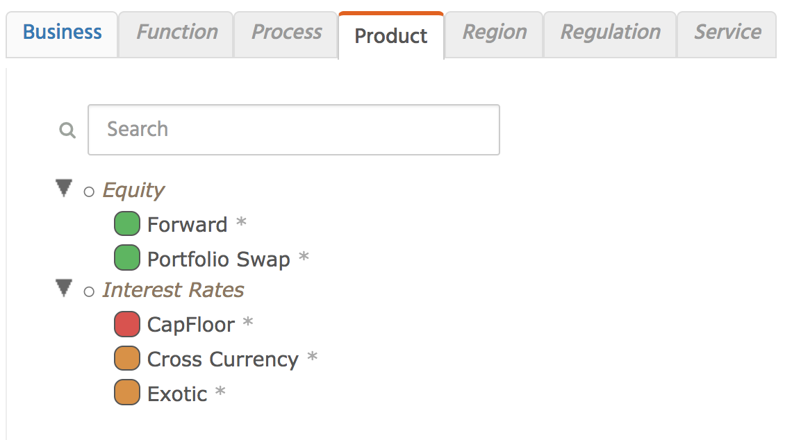
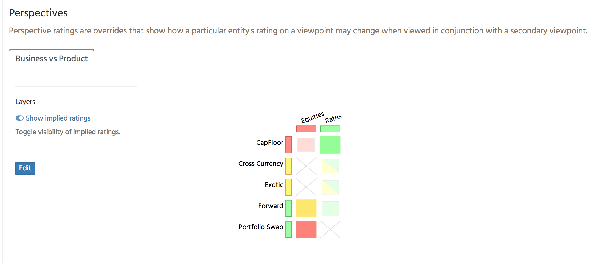
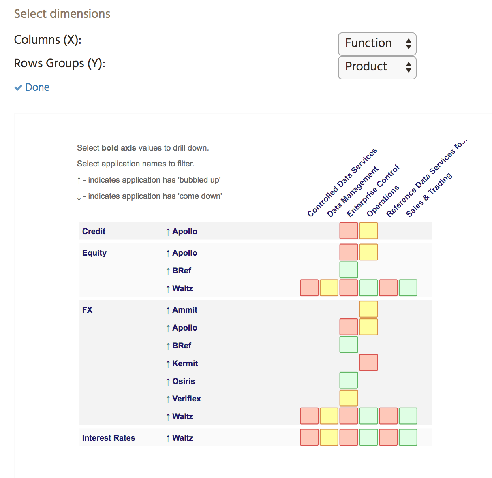
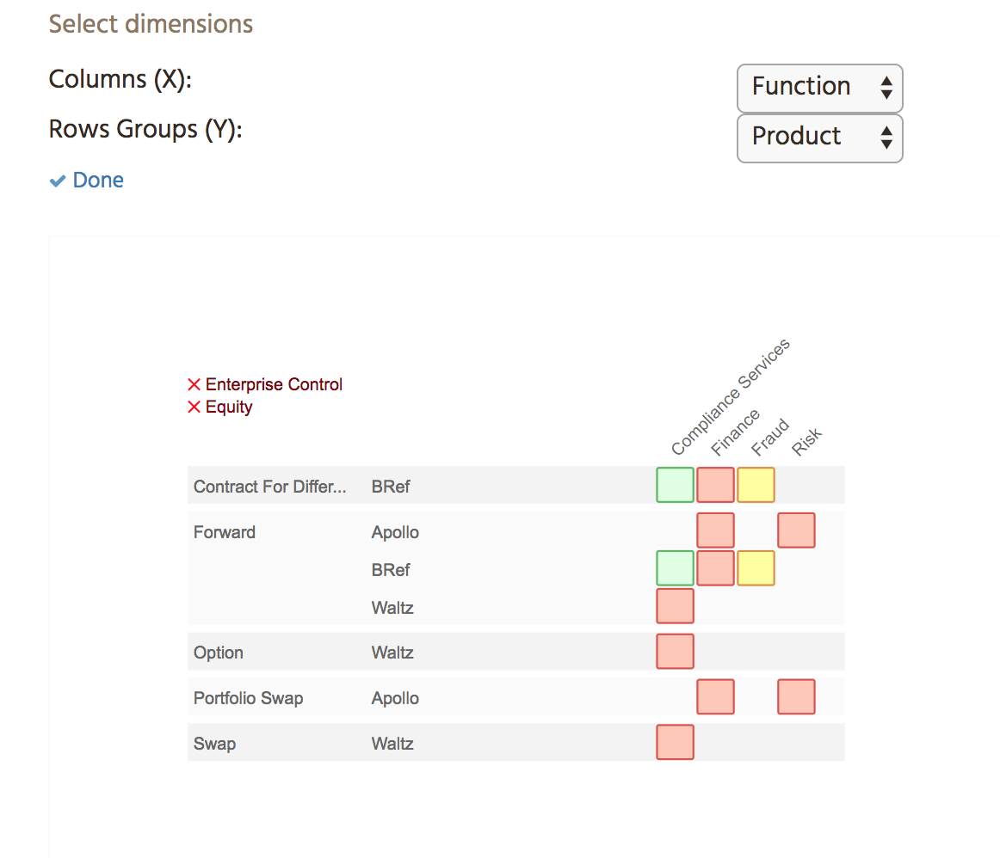

# (Deprecated) Using Perspectives and Drill Grids

**Note** these features have been deprecated from Waltz 1.14 as user uptake was low and complexity was high.

This document addresses how two features in Waltz may be used to facilitate a better understanding of the 
data within Waltz.

## Perspectives

Waltz, by design, typically stores simple facts against entities.  For example:

- _Application A_ supports _Function F_
- _Application B_ supports _Service Y_
- _Service Y_ relates to _Product P_

Sometimes a more nuanced view is required, to support this Waltz supports an extension to the above model 
known as **Perspectives**.  Currently perspectives allow you to refine an application view by combining two 
viewpoints (taxonomies) into a grid and allowing users to specify which combinations of viewpoint items 
are valid and which are not.  For example if we have a set of simple facts (for _business_ and 
_product_) stored against an application like so:

We can create a viewpoint relating _Business_ against _Product_ and specify the valid combinations.  
The _Products_ form the rows and the _Businesses_ form the columns.

From this diagram we can see the second column (_Business / Rates_) explicitly has a rating 
for _Rates/CapFloor_ and implicit ratings for the rest.  Also it explicitly states 
that _Rates/Portfolio Swap_ is an invalid combination. The colors indicates the alignment
to the *rating scheme* (typically _Invest/Disinvest/Maintain_) which can be configured to 
suit the domain.  

Multiple perspectives can be defined in Waltz, but each can only related two viewpoints.

### Limitations of perspectives:

- Limited to two 'dimensions'
- Only available against applications (cannot record a perspective for other types of entities)
- No aggregate (summary) views yet. It's on backlog, but currently unprioritized
- **Increases complexity** and effort involved in mapping (n x n, rather than 2 x n)
- Uptake of existing functionality has been low due to above mentioned complexity/effort
- Perspectives are currently unaware of hierarchies and view the viewpoints as flat structures
  (as can be seen in the TBC columns).

## Drill Grid View

Waltz recently introduced a new way to view two viewpoints together at an aggregate level 
(i.e. Organisation Unit).  This allows users to pick two viewpoints (or select from pre-defined 
combinations) and navigate through the application data (simple facts) for those dimensions. 
 he drill grid has similarities to the familiar pivot table in Excel. 

In this example we will use _Function_ and _Product_.  Initially the columns are the top level 
_Functions_ and the rows represent _Products_ with the applications against that deal with those
 products.

 
We can select a column or row-group to drill into more detail.  In this example we have drilled into 
the _Operations function_ (columns) and into the _Equity product_ sub-tree (the popup shows more detail about the selected cell)
 

 
### Limitations of drill grids:
- Currently only used against simple facts (not perspective aware yet, on backlog but nor prioritized)
- Row groups are dominant (they determine the apps to show, columns are there as supplemental detail)
- Can be quite complex to operate/interpret.
- Problems scaling to large numbers of applications
- Limited to operating on applications within an organisational unit.

---
[Back to measurables](README.md)
