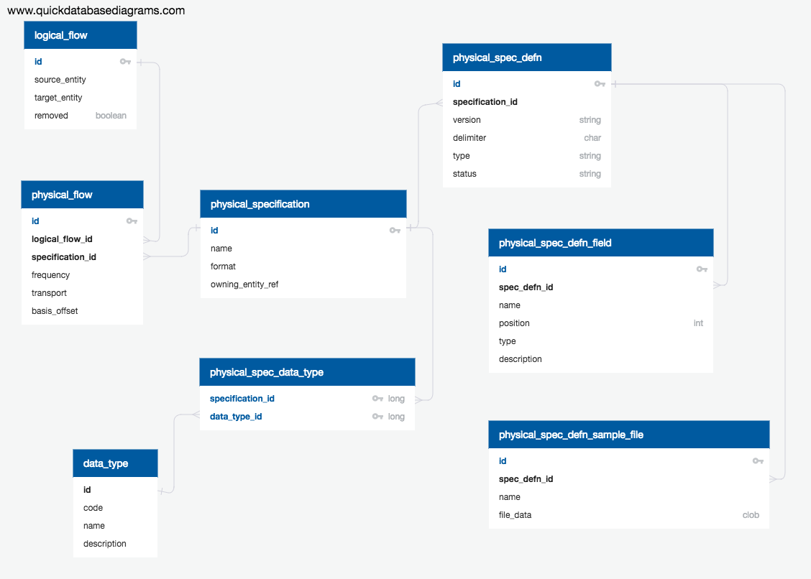

# Physical Flows

## Overview

Physical flows describe what, when and how information is transferred over logical flows.   

## Model

[Source](https://app.quickdatabasediagrams.com/#/schema/-wUbwXJBLUa_nILyAasDBA)

The physical flow data model is comprised of several parts:
 
 - `physical_flow` - detail the mechanics of the flow - how often and over what transport
 - `physical_specifications` - describe at a high level what is in the flow
 - `physical_spec_defn` (`_field` / `_sample_file`) - describe the format of the data being transferred
 - `physical_spec_data_type` - describes the data types of the information transferred