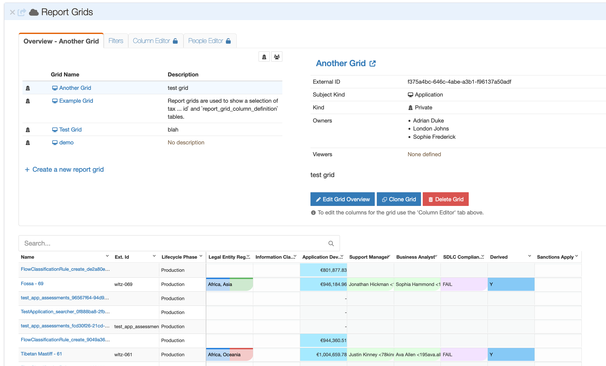
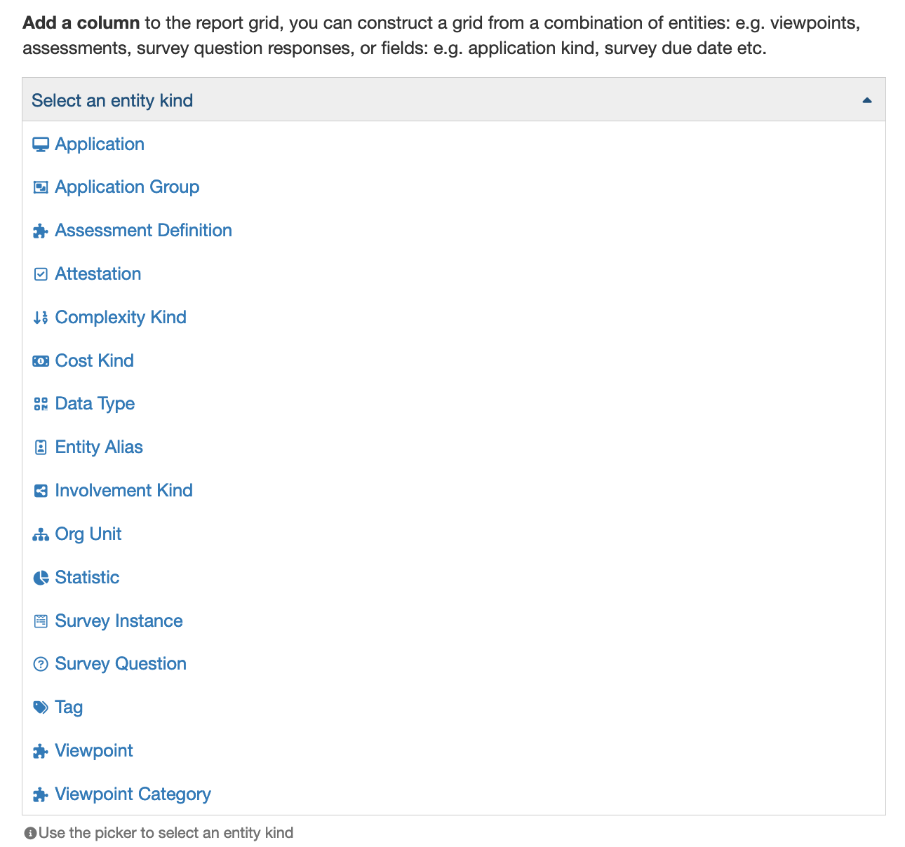
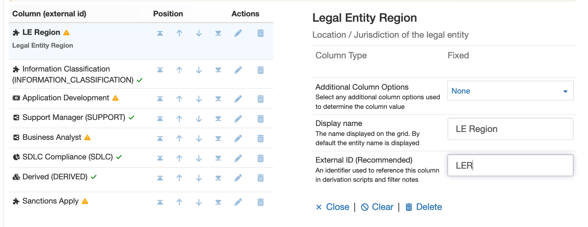
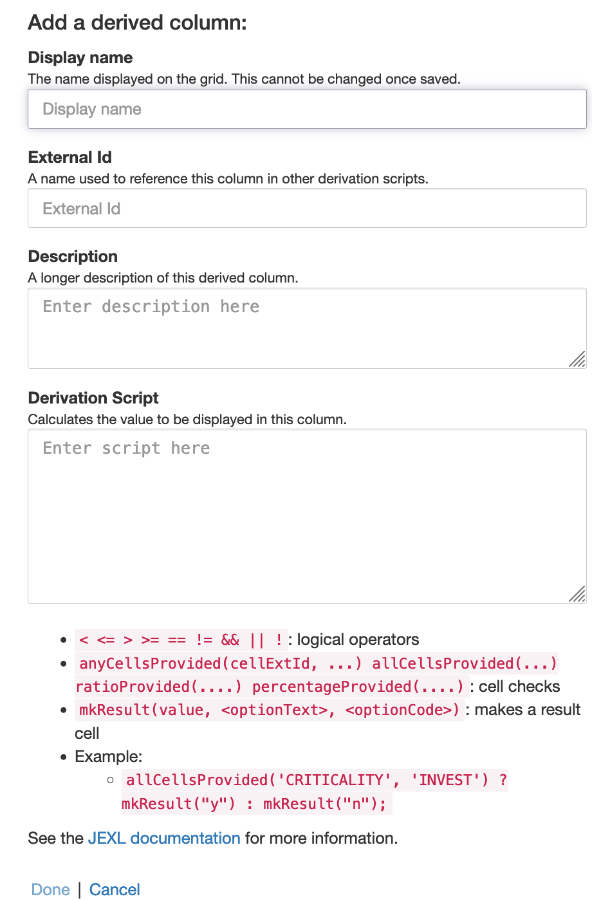
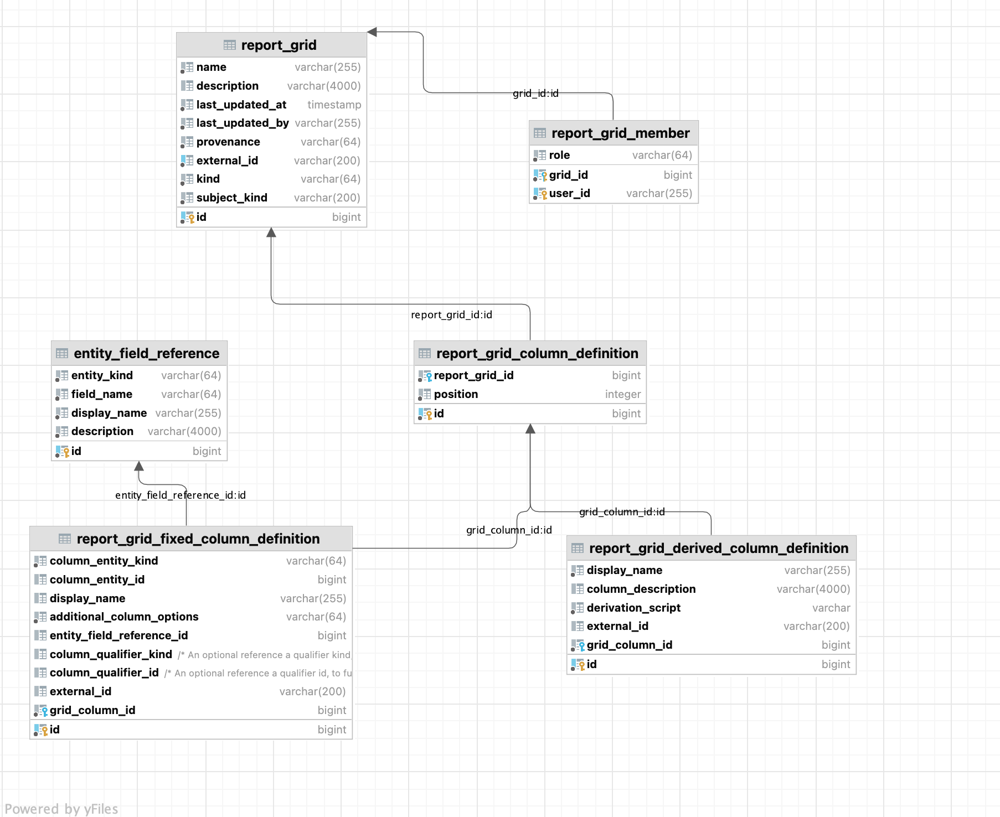

# Report Grids

## Overview

Report grids in Waltz offer users a convenient way to generate reports.
A report grid is essentially a set of applications or change initiatives presented in a grid format.
The rows in the grid represent individual entities, while the columns correspond to specific fields associated with those entities.

The grid has the ability to traverse multiple types of relationships within Waltz, the report grid can include a large selection of data fields.
This makes it an incredibly powerful tool for data analysis and reporting.

After creating a report grid in Waltz, it can be applied to any vantage point within the platform, such as Org Units, App Groups, People, and more. 

This flexibility enables users to quickly and easily generate reports from a variety of perspectives, depending on their needs. By using report grids, users can save time and effort by avoiding the need to recreate reports from scratch for each individual vantage point. Instead, they can simply apply an existing report grid and obtain the desired data with minimal effort.

### Field Columns

Grids support a wide variety of fields related to the driving entity type, which can be either an application or a change initiative.

After a field has been selected, the user can proceed to configure further details.
The nature of these details may depend on the specific type of field that is being configured. For instance, the user might need to choose a particular assessment definition in order to complete the configuration.

Alternatively, the details could be more general in nature, such as adjusting the column title or rearranging the order of fields.
An important additional property to configure is the _external id_ field, this is crucial to the usage of derived fields and filter groups.

### Derived Columns

Derived columns allows users to create new fields based on existing ones.
Waltz uses a simple language ([JEXL](http://commons.apache.org/proper/commons-jexl/reference/syntax.html)) to evaluate expressions.

#### Functions
In addition to the core JEXL features Waltz offers the following functions and fields.

| name                                                 | description                                                                                                        | example                                                                                        |
|------------------------------------------------------|--------------------------------------------------------------------------------------------------------------------|------------------------------------------------------------------------------------------------|
| `subjectId`                                          | the Waltz id for the row entity (e.g. app id). You may want to use subjectExternalId instead                       | `mkResult(subjectId %2 == 0 ? "Even" : "Odd")`                                                 | 
| `subjectName`                                        | the Waltz name for the row entity (e.g. app name)                                                                  | `mkResult(subjectId %2 == 0 ? subjectName + " is Even" : null)`                                | 
| `subjectExternalId`                                  | the Waltz external identifier for the row entity (e.g. app asset code)                                             | `mkResult(subjectName + '(' + subjectExternalId + ")")`                                        | 
| `subjectLifecyclePhase`                              | the lifecycle phase for the row entity (e.g. Production, Development, Conceptual, Retired)                         | `mkResult(subjectName + '(' + subjectLifecyclePhase + ")")`                                    | 
| `mkResult(value)`                                    | creates a value to display in the cell                                                                             | `mkResult("Hello World")`                                                                      |
| `mkResult(value, optText, optCode)`                  | creates a value to display in the cell with a given option text and code, these options will be used for filtering | `mkResult("Important", "Important Outcome", "L1")`                                             |
| `allCellsProvided(c1, c2...)`                        | true if _all_ of the cells provided are non-null                                                                   | `allCellsProvided(c1, c2) ? mkResult("ALL") : null`                                            |
| `anyCellsProvided(c1, c2...)`                        | true if _any_ of the cells provided are non-null                                                                   | `anyCellsProvided(c1, c2) ? mkResult("SOME") : null`                                           |
| `cell(c)`                                            | the Cell object associated with the given column external id (or null). The next table has more information about cells | `cell("LER")`                                                                                  |
| `numToOucome(val, [b1, outcome1, b2, outcome2, ...)` | takes a numeric value a list which specifies a boundary and the outcome for any value below that boundary          | `numToOutcome(cell('CTB').numberValue(), [ 0, "Zero", 100000, "smallish", 100000000, "big" ]`) |

As described above the `cell(c)` method can be used to get a row cell object.
The row cell object has the following properties/methods.  

Property/Method | Description | _Example_ usage for field types
--- | --- | ---
`textValue()` | optional string value | `subjectName`, surveyResponses, ...
`numberValue()` | optional numeic values | amount, complexity, ...
`dateTimeValue()` | optional date values | attestation dates, survey submissions, ...
`ratingIdValue()` | used to reference the values of rating cells | assessment cells, ...
`comment()` | optional comment for the cell value | measurable ratings, assessments, ...

### Filters

TBC

### Filter Groups

TBC

## Schema

## Jobs

---
[Back to ToC](../README.md)
