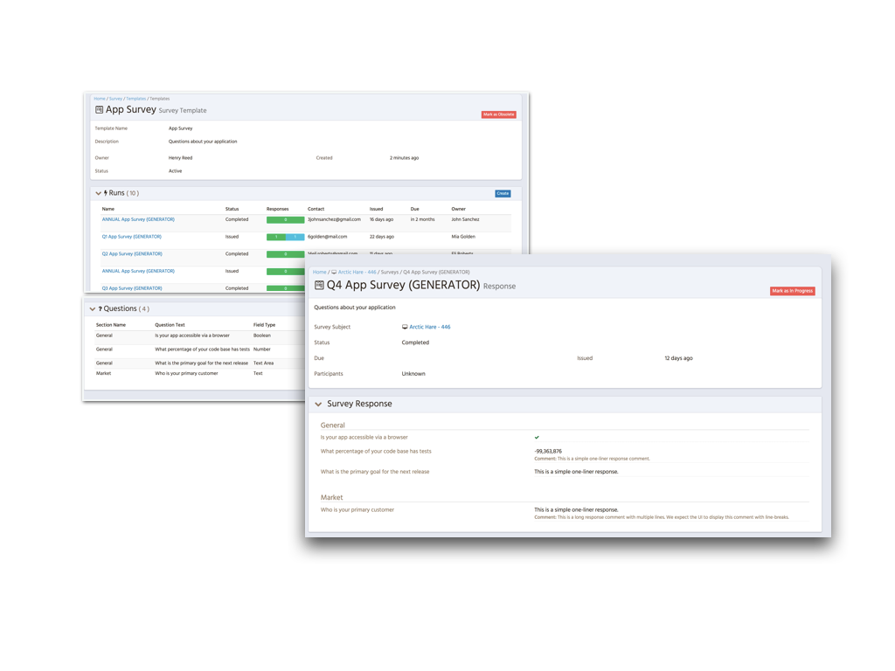
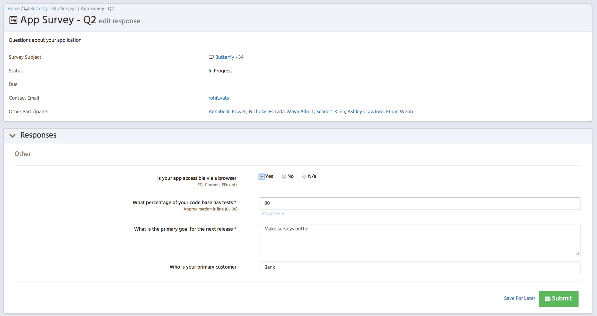

= Surveys
David Watkins <davidwatkins73@gmail.com>
:toc:

<<<
== Overview

Surveys allow for the collection of ad-hoc data within the overall structure of Waltz.
Surveys are focused on a specific entity type (e.g. APPLICATION, CHANGE_INITIATIVE) and issued to users matching a given set of roles describing their involvement with the entity.
The set of target entities for the survey is derived from a Waltz selection mechanism (e.g. apps under a specific organisational unit, apps performing a specific function etc).

.Survey screenshots (management and view)

.Survey screenshots (editing)

=== Survey Instance Lifecycle

A survey can be issued via the `Surveys` section on the navigation bar for the related entity type, provided there is an existing survey template.
Alternatively, these can be issued in bulk via a 'Survey Run' by a 'Survey Admin'.

Survey Owners have the ability to:
 - `WITHDRAW` a survey at any stage, unless `COMPLETED` or `APPROVED`. 
 - `APPROVE` or `REJECT` a survey once completed.
 - Change the 'Due' date.
 - Assign other recipients.

Survey recipients have the ability to:
  - Edit the survey response.
  - Assign other recipients.
  
If a `COMPLETED` or `WITHDRAWN` survey is reopened, or if a survey is `REJECTED`, the version number will increase.

The diagram below show the state transition diagram for surveys.
Green transitions indicate actions that may be performed by participants and/or survey administrators.
Transitions restricted to survey administrators are red.

[graphviz, survey_state_diagram, svg]
.State transition diagram
----
digraph survey_state_machine {
    nodesep=0.7;

    NOT_STARTED -> WITHDRAWN [color=red, label=withdrawing];
    NOT_STARTED -> COMPLETED [color=green, label=submitting];
    NOT_STARTED -> IN_PROGRESS [color=green, label=saving];
    IN_PROGRESS -> COMPLETED [color=green, label=submitting];
    IN_PROGRESS -> WITHDRAWN [color=red, label=withdrawing];
    IN_PROGRESS -> IN_PROGRESS [color=green, label=saving];
    COMPLETED -> APPROVED [color=red, label=approving];
    COMPLETED -> REJECTED [color=red, label=rejecting];
    APPROVED -> IN_PROGRESS [color=green, label=reopening];
    REJECTED -> WITHDRAWN [color=red, label=withdrawing];
    REJECTED -> IN_PROGRESS [color=green, label=reopening];
    WITHDRAWN -> IN_PROGRESS [color=red, label=reopening];

    {rank="same"; APPROVED; REJECTED}
}
----

<<<
== Model

.Schema model
image::images/survey_schema.png[Schema Diagram]
https://app.quickdatabasediagrams.com/#/schema/YLytE3nJy0OVTId-YZkXew[Source]

== Survey Templates

Survey templates are collection of survey questions for a specific target entity kind.
Survey templates can be created by 'Survey Admin' in the `Surveys` section in the menu dropdown bar.
Survey runs are created based on a survey template.
