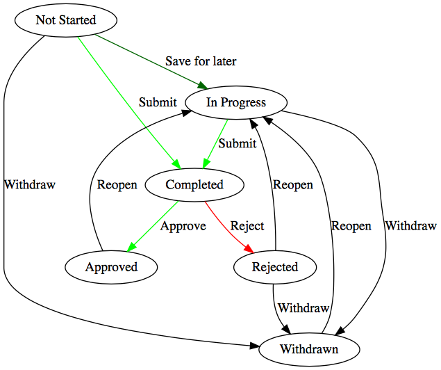

# Surveys

## Overview

Surveys allow for the collection of ad-hoc data within 
the overall structure of Waltz.  Surveys are focused on a 
specific entity type (e.g. APPLICATION, CHANGE_INITIATIVE) 
and issued to users matching a given set of roles describing 
their involvement with the entity.  The set of target entities
for the survey is derived from a Waltz selection mechanism 
(e.g. apps under a specific organisational unit, apps performing
a specific function etc.).

####Survey Instance Lifecycle
A survey can be issued via the `Surveys` section on the navigation bar for the related entity type, provided there is an existing survey template. Alternatively, these can be issued in bulk via a 'Survey Run' from a 'Survey Admin'.

Survey Owners have the ability to:
 - `WITHDRAW` a survey at any stage, unless `COMPLETED` or `APPROVED`. 
 - `APPROVE` or `REJECT` a survey once completed.
 - Change the 'Due' date.
 - Assign other recipients.

Survey recipients have the ability to:
  - Edit the survey response.
  - Assign other recipients.
  
If a `COMPLETED` or `WITHDRAWN` survey is reopened, or if a survey is `REJECTED`, the version number will increase.

[Source](https://dreampuf.github.io/GraphvizOnline/#digraph%20G%20%7B%0A%20%20%20%20%0A%20%20%20%20NOT_STARTED%5Blabel%3D%22Not%20Started%22%5D%0A%20%20%20%20IN_PROGRESS%5Blabel%3D%22In%20Progress%22%5D%0A%20%20%20%20COMPLETED%5Blabel%3D%22Completed%22%5D%0A%20%20%20%20REJECTED%5Blabel%3D%22Rejected%22%5D%0A%20%20%20%20WITHDRAWN%5Blabel%3D%22Withdrawn%22%5D%0A%20%20%20%20APPROVED%5Blabel%3D%22Approved%22%5D%0A%20%20%20%20%0A%20%20%20%20NOT_STARTED%20-%3E%20COMPLETED%5Blabel%3D%22Submit%22%2Ccolor%3D%22green%22%5D%0A%20%20%20%20NOT_STARTED%20-%3E%20IN_PROGRESS%5Blabel%3D%22Save%20for%20later%22%2Ccolor%3D%22darkgreen%22%5D%0A%20%20%20%20NOT_STARTED%20-%3E%20WITHDRAWN%5Blabel%3D%22Withdraw%22%5D%0A%20%20%20%20%0A%20%20%20%20IN_PROGRESS%20-%3E%20COMPLETED%5Blabel%3D%22Submit%22%2Ccolor%3D%22green%22%5D%0A%20%20%20%20IN_PROGRESS%20-%3E%20WITHDRAWN%5Blabel%3D%22Withdraw%22%5D%0A%20%20%20%20%0A%20%20%20%20COMPLETED%20-%3E%20REJECTED%5Bcolor%3D%22red%22%2C%20label%3D%22Reject%22%5D%0A%20%20%20%20COMPLETED%20-%3E%20APPROVED%5Bcolor%3D%22green%22%2C%20label%3D%22Approve%22%5D%0A%20%20%20%20%0A%20%20%20%20REJECTED%20-%3E%20IN_PROGRESS%5Blabel%3D%22Reopen%22%5D%0A%20%20%20%20REJECTED%20-%3E%20WITHDRAWN%5Blabel%3D%22Withdraw%22%5D%0A%20%20%20%20%0A%20%20%20%20WITHDRAWN%20-%3E%20IN_PROGRESS%5Blabel%3D%22Reopen%22%5D%0A%20%20%20%20%0A%20%20%20%20APPROVED%20-%3E%20IN_PROGRESS%5Blabel%3D%22Reopen%22%5D%0A%0A%7D)

## Model

[Source](https://app.quickdatabasediagrams.com/#/schema/YLytE3nJy0OVTId-YZkXew)

## Survey Templates

Survey templates are collection of survey questions for a specific target entity kind. Survey templates can be created by 'Survey Admin' in the `Surveys` section in the menu dropdown bar.
Survey runs are created based on a survey template.

#### Template State Diagram

---
[Back to ToC](../README.md)