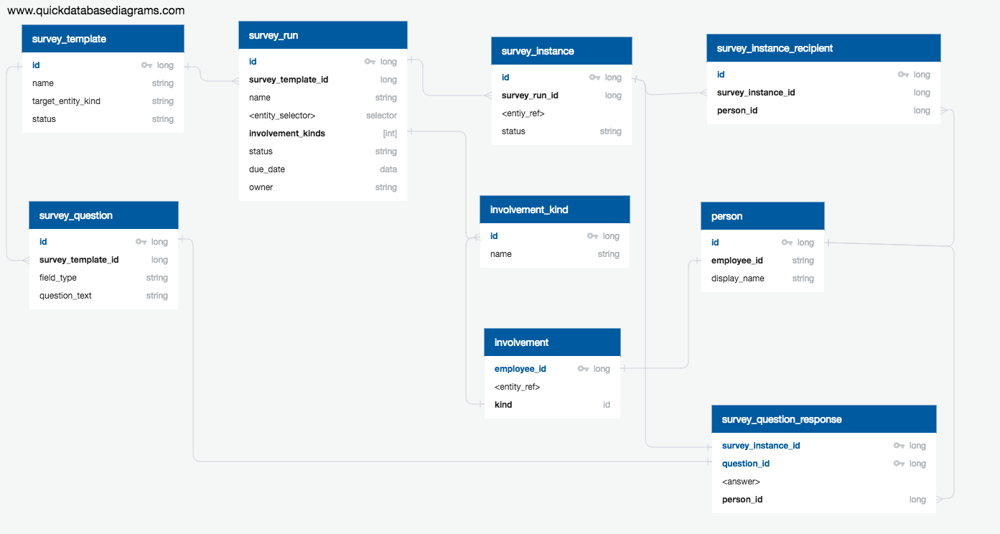

# Surveys

## Overview

Surveys allow for the collection of ad-hoc data within 
the overall structure of Waltz.  Surveys are focused on a 
specific entity type (e.g. APPLICATION) and  

## Model

[Source](https://app.quickdatabasediagrams.com/#/schema/-Ix5XDNAT0GKLh4hx2n6Mg)

