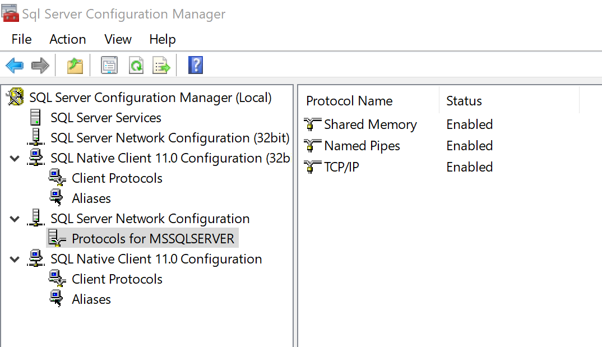

# Microsoft MSSQL Server 2017

## Enable Remote connections

Use the _SQL Server Configuration Manager_ (`C:\Windows\SysWOW64\SQLServerManager14.msc`)
to enable named pipes and tcp/ip:

After enabling the remote connections you will need to restart the server:

 