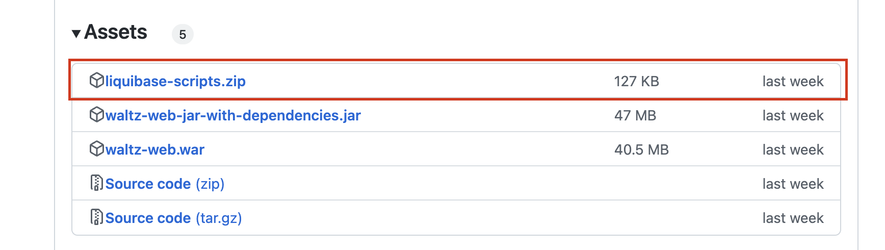

# Liquibase

Waltz uses [Liquibase](http://www.liquibase.org/index.html) to manage it's schema.

## Authoring

The changelog file follows the [best practice guidelines](http://www.liquibase.org/bestpractices.html) outlined
on the liquibase site.

### Change Ids

Id's have undergone several changes since project inception.  The current format is:

`<yyyymmdd>-<issueId>-<counter>`

For example:

`20160302-102-2` can easily be read as the second change relating to issues 102 and was created on 2nd March 2016.
Strictly speaking the date is not required, but it helps when searching for changes in a certain time range.


## Updating the database

Liquibase can either apply the changes directly to the database or prepare an sql file for manual execution.

The placeholder `<path to changelog master>` in the examples below points to where the liquibase files are located.
If the files have been obtained by cloning the Waltz repository then the location will be:

`<path_to_repo>/waltz-schema/src/main/resources/liquibase`

An _alternative_ mechanism to get the files is to download and extract them from the zip provided on the [Releases](https://github.com/finos/waltz/releases) page on Github.
For example:


### Executing the changes using Liquibase:

This approach uses Liquibase to directly modify the database.

For more information see:

- Liquibase [update](https://docs.liquibase.com/commands/update/update.html) command

#### Sample .bat file (MSSQL)
```
C:/tools/liquibase-3.5.5-bin/liquibase.bat ^
--driver=com.microsoft.sqlserver.jdbc.SQLServerDriver ^
--classpath=<path to driver>/sqljdbc4-4.0.2206.100.jar ^
--changeLogFile=<path to changelog master>/db.changelog-master.xml ^
--url="jdbc:sqlserver://<host>:<port>;databaseName=<database>" ^
--username=<user> ^
--password=<password> ^
update
```

#### Sample .sh file (PostgreSQL)
```
#!/bin/sh
liquibase --driver=org.postgresql.Driver \
      --classpath=<path to driver>/postgresql-42.2.5.jar \
      --changeLogFile=<path to changelog master>/db.changelog-master.xml \
      --url="jdbc:postgresql://<host>:<port>/waltz" \
      --username=<user> \
      --password=<password> \
      update
```

Waltz provides sample files:
- `migrate*.*`

Which you may copy and adapt to your environment.


### Generating SQL for the changes:

If you cannot run _Liquibase_ directly against your database you have the option of generating a sql file containing the changes.
This file can then be snet to an operations team who can perform the change on your behalf.

For more information see:

- Liquibase [update-sql](https://docs.liquibase.com/commands/update/update-sql.html) command

#### Sample .bat file (MSSQL)
```
C:/tools/liquibase-3.5.5-bin/liquibase.bat ^
--driver=com.microsoft.sqlserver.jdbc.SQLServerDriver ^
--classpath=<path to driver>/sqljdbc4-4.0.2206.100.jar ^
--changeLogFile=<path to changelog master>/db.changelog-master.xml ^
--url="jdbc:sqlserver://<host>:<port>;databaseName=<database>" ^
--username=<user> ^
--password=<password> ^
updateSQL
```

### Sample .sh file (PostgreSQL)
```
#!/bin/sh
liquibase --driver=org.postgresql.Driver \
      --classpath=<path to driver>/postgresql-42.2.5.jar \
      --changeLogFile=<path to changelog master>/db.changelog-master.xml \
      --url="jdbc:postgresql://<host>:<port>/waltz" \
      --username=<user> \
      --password=<password> \
      updateSQL
```
